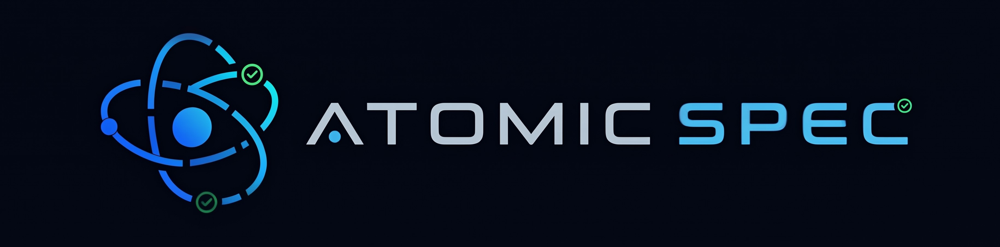

<div align="center">



### Stop your AI from vibe-coding.

[](https://pypi.org/project/atomic-spec/)
[](https://pypi.org/project/atomic-spec/)
[](./LICENSE)
[](#ai-coding-agents-supported)
[](#status)

**Spec-kit taught AI agents a workflow. Atomic Spec makes them obey it.** When `/atomicspec.implement` runs, the agent is *architecturally prevented* from reading `plan.md` or `spec.md` — it sees only the current task file, pre-loaded with every registry value, domain rule, and gate criterion it needs. No drifting mid-feature. No hallucinating a new approach on pass three. No 800-line "kitchen sink" PRs.

```bash
uv tool install atomic-spec
atomicspec init my-project --ai claude
```

</div>

> **TL;DR** — One AI instruction file isn't enough. Atomic Spec enforces **eight non-negotiable rules**: one task per file, AI sees only the current task during coding, human sign-off at four checkpoints, and a project registry that remembers every decision. If you've ever reviewed an AI PR and thought *"where did this pattern come from?"* — that's the problem this exists to kill.

---

## Status

**v0.1.x · first public release.** The core governance model (Eight Prime Directives, Context Pinning, Atomic Injunction) is stable and exercised on every release. APIs and command names may evolve through v0.x. Claude Code is the reference implementation and validated end-to-end; 12 other agents are experimental (templates install correctly, agent-specific wiring not yet exhaustively tested). [See the agent tier table below](#ai-coding-agents-supported).

---

## Why not just use [X]?

Atomic Spec occupies a specific slot in the AI-coding ecosystem. Here's where it fits:

| Tool | Enforcement | Context isolation | Cross-feature consistency | Audit trail |
|------|-------------|-------------------|---------------------------|-------------|
| `AGENTS.md` / `.cursorrules` / `CLAUDE.md` | Soft guidance in a single file | None | Relies on the agent re-reading | None |
| `aider` conventions file | Soft guidance, per-session | None | Manual | Git history only |
| `continue.dev` rules | Soft guidance, IDE-integrated | None | Manual | None |
| `github/spec-kit` (upstream) | Workflow templates; agent is asked nicely | None (agent reads everything) | Templates, not enforced | None |
| **Atomic Spec** | **Gated phases + forbidden-reads during implementation** | **Context Pinning: agent sees only current task file** | **Project Defaults Registry enforced on every command** | **Registry changelog + per-task traceability matrix** |

If you want *recommendations* for your AI, the tools above are lighter and fine. If you want the AI to physically not be able to drift — because it cannot see the thing that would let it drift — that's what Atomic Spec adds.

---

## The Eight Prime Directives

Article IX of `memory/constitution.md` hardcodes eight non-negotiable rules. Every command in the framework enforces them.

| # | Directive | Rule |
|---|-----------|------|
| 1 | **Directory Supremacy** | Every feature MUST have an `index.md` (dashboard) and `traceability.md` (matrix) |
| 2 | **Atomic Injunction** | `/atomicspec.tasks` is FORBIDDEN from creating a single `tasks.md` — must create `tasks/` directory with individual `T-XXX-[name].md` files |
| 3 | **Context Pinning** | During `/atomicspec.implement`, AI is FORBIDDEN from reading `plan.md` — may ONLY read `index.md`, the specific task file, and `traceability.md` |
| 4 | **Gate Compliance** | MUST follow Knowledge Station gate criteria before phase transitions |
| 5 | **Knowledge Routing** | When encountering unknown decisions, MUST consult Station Map first, then the specific station |
| 6 | **Human-In-The-Loop** | During `/atomicspec.plan`, AI MUST pause at 4 checkpoints for user approval |
| 7 | **Project Defaults Registry** | All commands MUST read `specs/_defaults/registry.yaml` and enforce project-wide standards |
| 8 | **Self-Contained Tasks** | Task files MUST embed all context (registry, domain rules, gate criteria) for implementation |

---

## The Assembly Line Mental Model

Atomic Spec treats AI-driven development like a **factory assembly line**, not a freeform workshop. Every phase of your work is a **station**, and the product (your code) moves from one station to the next only when it passes inspection.

- **Stations** — each phase (specify → plan → tasks → implement) is a discrete station with a clear job. Knowledge Stations in `.specify/knowledge/stations/` extend this: 18 procedural guides covering every aspect of building a SaaS product.
- **Deliverables** — each station outputs tangible artifacts: a spec file, a plan document, atomic task files, production code. If you can't open it, read it, run it, or test it, it's not a deliverable.
- **Gates** — each station ends with objective pass/fail criteria. "Feels good" is never a gate. The spec has edge cases or it doesn't. The tenancy model is decided or it isn't.
- **Core rule** — **no gate pass → no proceeding**. You cannot enter planning without a passing spec. You cannot generate tasks without a passing plan. You cannot implement without passing gates.

This is the entire reason Atomic Spec exists: **AI coding agents produce drift when they operate without gates**. The assembly line replaces vibes with checkpoints.

---

## Before and After

<table>
<tr>
<th>Before — a single <code>tasks.md</code></th>
<th>After — atomic <code>tasks/T-XXX-*.md</code> (enforced)</th>
</tr>
<tr>
<td>

```markdown
# Tasks for 003-user-auth

- [ ] Set up JWT library
- [ ] Create /login endpoint
- [ ] Add password hashing
- [ ] Add rate limiting
- [ ] Write tests
- [ ] Add forgot-password flow
... 34 more ...
```

**Problem:** AI reads the whole file on every
implementation run. Context window fills with
sibling tasks. No embedded decisions, so the
agent re-derives the tech stack each pass —
often differently. No way to trace which task
satisfies which requirement.

</td>
<td>

```
specs/003-user-auth/
├── index.md            # feature dashboard
├── traceability.md     # FR → task matrix
└── tasks/
    ├── T-001-scaffold-jwt-config.md
    ├── T-002-implement-login-endpoint.md
    ├── T-003-password-hashing.md
    └── ...
```

**Each task file embeds:** registry values it must
obey, domain rules from the relevant subagent, a
verification command, and which requirement (`FR-012`)
it satisfies. During `/atomicspec.implement`, the
agent is forbidden from reading anything else.

</td>
</tr>
</table>

---

## Quick Start

### Install

```bash
# Preferred: install the CLI as an isolated tool
uv tool install atomic-spec

# Alternative: pipx
pipx install atomic-spec
```

### Initialize a project

```bash
atomicspec init my-project --ai claude     # or --ai cursor-agent, copilot, gemini, windsurf
cd my-project
git checkout -b 001-your-feature-name
```

### Use the slash commands in your AI agent

```text
/atomicspec.constitution              # establish project principles (once)
/atomicspec.registry                  # discover and populate project defaults (once, or to refresh)
/atomicspec.specify "your feature"    # generate a spec with gate criteria
/atomicspec.plan                      # produces plan.md, pauses at 4 HITL checkpoints
/atomicspec.tasks                     # writes tasks/T-XXX-*.md (never a single tasks.md)
/atomicspec.implement                 # Context-Pinned implementation + Phase 9 registry sync on exit
```

See the [quickstart guide](https://chappygo-os.github.io/Atomic-Spec/docs/quickstart) for the full walkthrough, including optional commands (`/atomicspec.clarify`, `/atomicspec.analyze`, `/atomicspec.checklist`, `/atomicspec.cleanup`, `/atomicspec.analyze-competitors`, `/atomicspec.taskstoissues`) and the `init-project.{sh,ps1}` script path for offline/local installs.

### The registry workflow (Directive 7 end-to-end)

`specs/_defaults/registry.yaml` is the Project Defaults Registry — the single source of truth for every project-wide decision (language, framework, database, tenancy model, API conventions, etc.). The framework keeps it honest at three points:

- **On entry** — every command reads it before generating anything. Missing registry is a GATE FAIL (set `ATOMIC_SPEC_NO_REGISTRY=1` to override for CI/legacy).
- **During planning** — `/atomicspec.plan` Phase 0.9 captures any new decisions made during tech-stack review for user-approved registry addition.
- **On exit from implementation** — `/atomicspec.implement` Phase 9 scans completed work for patterns that became project-wide (tenant_id filtering everywhere, RFC7807 error envelopes, structured logging) and offers them as registry candidates. One batched HITL confirmation per feature — no per-task friction.

`/atomicspec.registry` is the bootstrap / backfill command: run it once to discover defaults from your manifests (package.json, pyproject.toml, Cargo.toml, go.mod, Dockerfile, CI workflows, etc.), confirm the findings, and fill in what static scan can't reveal.

### AI coding agents supported

**Supported tier** (validated end-to-end): Claude Code · Cursor · GitHub Copilot · Gemini CLI · Windsurf

**Experimental tier** (templates install correctly, agent-specific wiring not exhaustively tested): Qwen Code · opencode · Codex CLI · Kilo Code · Auggie CLI · CodeBuddy · Qoder CLI · Roo Code · Amazon Q Developer CLI · Amp · SHAI · IBM Bob

Experimental-tier issues are labeled `experimental` and triaged best-effort. PRs that promote an agent to Supported tier are welcome — see [SUPPORT.md](./SUPPORT.md) for triage policy and promotion criteria.

---

## Project Defaults Registry

**Constitution Directive 7** introduces a central source of truth for project-wide technical decisions.

### What It Does

The **Project Defaults Registry** at `specs/_defaults/registry.yaml` stores all project-wide technical decisions:

```yaml
# specs/_defaults/registry.yaml
version: 2
architecture:
  pattern: monolith          # or microservices, serverless
  layers: clean              # or mvc, vertical_slice
  api_style: rest            # or graphql, grpc
code_patterns:
  data_access: repository    # or active_record, query_builder
  error_handling: result_type # or exceptions, error_codes
  validation_approach: schema # or manual, decorator
backend:
  language: typescript
  framework: express
database:
  type: postgresql
  tenancy_model: shared_db_tenant_id
# ... 80+ configurable decisions
```

### How It Works

| Phase | Action |
|-------|--------|
| **On Entry** | Every command reads registry, applies existing defaults |
| **During Work** | New decisions prompt user: "Add to project defaults?" |
| **On Exit** | Registry sync checkpoint collects all new decisions with HITL approval |
| **Deviation** | Using a different value requires explicit DEVIATION block + approval |

### HITL Requirements

Every registry change requires Human-In-The-Loop approval:

```
══════════════════════════════════════════════════════════════
📋 REGISTRY SYNC - Phase 0.9 Checkpoint
══════════════════════════════════════════════════════════════

The following decisions were made in this planning session
and are NOT yet in the project defaults registry:

| Key                      | Value           | Add to Registry? |
|--------------------------|-----------------|------------------|
| backend.language         | typescript      | Candidate        |
| backend.framework        | express         | Candidate        |

Adding these to the registry means ALL future features
will use these as defaults.
══════════════════════════════════════════════════════════════
```

### Audit Trail

All changes are logged in `specs/_defaults/changelog.md`:

```markdown
### 2026-02-06 | backend.language
- **Changed**: `null` → `typescript`
- **Why**: Decided during user-auth feature planning
- **Source**: specs/001-user-auth/plan.md
- **Approved by**: Human (accept)
```

---

## Self-Contained Tasks (Knowledge Wiring)

**Constitution Directive 8** ensures task files contain ALL context needed for implementation.

### The Problem

During `/atomicspec.implement`, **Context Pinning** (Directive 3) prevents reading:
- `plan.md`, `spec.md`
- `.specify/knowledge/stations/*`
- `.specify/subagents/*`
- Other task files

This meant subagents were "blind" to project patterns and had to guess.

### The Solution

During `/atomicspec.tasks`, ALL context is **embedded INTO each task file**:

```markdown
# T-025-create-user-repository

## 📋 Embedded Context (READ THIS FIRST)

### Project Standards (from registry)
| Key | Value |
|-----|-------|
| `architecture.layers` | clean |
| `code_patterns.data_access` | repository |
| `database.tenancy_model` | shared_db_tenant_id |

### Domain Rules (from data-architecture subagent)
- **Tenancy**: Every query MUST filter by `tenant_id`
- **No naked queries**: All DB access through repository methods only
- **Audit columns**: Include `created_at`, `updated_at`, `created_by`

### Gate Criteria (from data-architecture subagent)
- [ ] Repository interface defined with tenant-scoped methods
- [ ] No direct ORM calls outside repository
- [ ] All queries filter by tenant_id

---

## 🎯 Objective
Create the UserRepository class implementing the repository pattern...
```

### Graceful Degradation

Not all projects have all knowledge sources:

| Missing Source | Action |
|----------------|--------|
| Registry | Embed: "No registry - using plan.md decisions" |
| Subagent | Check for full station file, extract key rules |
| Station | Embed: "No domain knowledge available" |
| Everything | Embed plan.md decisions directly, note limited context |

**Tasks are NEVER blocked by missing knowledge sources.**

---

## Dynamic Agent Discovery

**21 specialized subagents** are available in `.specify/subagents/`, matched dynamically based on feature needs.

### How It Works

Agent selection is **NOT hard-coded**. Instead:

1. **Scan available agents**: Read all `*.md` files in `.specify/subagents/` (excluding `_*` files)
2. **Extract metadata**: Parse YAML frontmatter for `name` and `description`
3. **Match by keyword overlap**: Compare spec/task keywords against each agent's YAML `description`
4. **Load relevant agents**: Only agents whose description matches the feature's needs

### Example Matching

```
Spec mentions "REST API", "endpoints"
  → Agent description: "Design RESTful APIs, microservice boundaries..."
  → Match: backend-architect ✓

Spec mentions "payment", "subscription"
  → Agent description: "Integrate Stripe, PayPal, and payment processors..."
  → Match: payment-integration ✓
```

### Default subagents

Atomic Spec ships with a curated set of recommended subagents in [`.specify/subagents/`](./.specify/subagents/). General-purpose agents cover backend, frontend, data, devops, AI, code review, business analysis, and language specialists (Python, TypeScript). Mobile projects additionally get a 157-agent lifecycle set under `.specify/subagents/mobile/` organized across 14 phases (Discovery through Documentation) — including mobile-specific security, testing, and UI/UX agents. The `security/`, `testing/`, and `design/` top-level folders exist as empty scaffolds for projects that want to add their own. They're defaults, not mandates — add your own, replace the ones you don't want, or delete the whole directory and start fresh. Each agent is a single markdown file with YAML frontmatter; the CLI discovers them by scanning the folder, so no registration step is needed.

### Adding Custom Agents

Create `.specify/subagents/custom/your-agent.md`:

```yaml
---
name: your-agent
description: Your agent's purpose and keywords for matching
model: opus  # or sonnet, haiku
---

Agent instructions here...
```

The agent will be automatically discovered and matched when features mention keywords from its description.

---

## Atomic Traceability Workflow

### Phase Flow

```
/atomicspec.registry (once)  -->  /atomicspec.specify  -->  /atomicspec.AnalyzeCompetitors (optional)  -->  /atomicspec.plan  -->  /atomicspec.tasks  -->  /atomicspec.implement (+Phase 9 registry sync)
     |                           |                                       |                    |                     |
     v                           v                                       v                    v                     v
  spec.md                  competitive-analysis/                   Phase 0.0: Registry    tasks/               Execute with
  + Gates 03-05            summary.md + competitors/               Phase 0.1: Domain      T-XXX-*.md           Context Pinning
  + Registry check         🛑 User review                          Phase 0: Research      index.md             + Registry
                           (accept/revise/reject)                  Phase 0.5: HITL #1     traceability.md      as reference
                                                                   Phase 0.6: Validate    + Embedded Context
                                                                   Phase 0.7: HITL #2     (from registry,
                                                                   Phase 0.8: HITL #3     subagents, gates)
                                                                   Phase 0.9: HITL #4
                                                                   Phase 1: Design
                                                                   + Gates 06-13
```

### Planning Phases Explained

| Phase | Name | Purpose |
|-------|------|---------|
| 0.0 | **Load Registry** | Read project defaults, pre-populate tech decisions |
| 0.1 | **Load Domain Knowledge** | Dynamically discover and load relevant subagents/stations |
| 0 | **Research** | Resolve unknowns, research best practices |
| 0.5 | **HITL #1: Tech Stack** | User approves language, framework, database choices |
| 0.6 | **Validation** | Check package compatibility, deprecation, conflicts |
| 0.7 | **HITL #2: Validation Review** | User reviews warnings, approves overrides |
| 0.8 | **HITL #3: UI Specs** | User selects UI library, state management, design system |
| 0.9 | **HITL #4: Registry Sync** | User approves adding new decisions to project defaults |
| 1 | **Design** | Generate data models, API contracts, architecture |

### Competitive Analysis (Optional)

The `/atomicspec.AnalyzeCompetitors` command is **optional** but recommended for customer-facing products. It follows Station 03 (Discovery) procedures:

1. **User Research Check** - Asks if you have existing competitive research to share
2. **Search Frame** - Defines primary, adjacent, and substitute categories
3. **Competitor Benchmarking** - Analyzes 5-15 competitors on positioning, pricing, workflows, integrations, and weak points
4. **Pain Mining** - Extracts user complaints from reviews, forums, and support docs
5. **Synthesis** - Produces wedge candidates and recommends a differentiation strategy

**Output Structure:**
```
specs/[feature]/competitive-analysis/
├── summary.md              # Main reference for downstream commands
├── user-research/          # Your existing research (if provided)
└── competitors/
    ├── competitor-1.md
    ├── competitor-2.md
    └── ...
```

**HITL Review:** After analysis, you review the summary and can:
- **Accept** - Keep for use in `/atomicspec.plan`
- **Revise** - Request changes
- **Reject** - Delete entirely (downstream commands proceed without competitive context)

**Why "Reject" Deletes Everything:** If you don't want competitive analysis influencing decisions, the folder is deleted. This signals to `/atomicspec.plan` that no competitive context exists, so it makes decisions based on general knowledge only. This is intentional - no analysis means no competitive influence.

### Human-In-The-Loop Checkpoint (Phase 0.5)

During `/atomicspec.plan`, after Phase 0 (Research) completes, the AI **MUST PAUSE** and present all tech stack decisions for user approval:

```
══════════════════════════════════════════════════════════════
🛑 TECH STACK REVIEW - Phase 0.5 Checkpoint
══════════════════════════════════════════════════════════════

| Decision          | Value             | Source   |
|-------------------|-------------------|----------|
| Language/Version  | Python 3.11       | Spec     |
| Storage           | PostgreSQL        | Assumed  |

⚠️ ASSUMPTIONS: Storage was assumed based on SaaS patterns.

Reply "proceed", "revise: [changes]", or ask questions.
══════════════════════════════════════════════════════════════
```

**Why this matters:** Tech stack decisions are expensive to change post-implementation. This checkpoint prevents AI from making assumptions that lead to rework.

### Gate Checkpoints

Each phase requires passing specific Knowledge Station gates:

| Phase | Command | Required Gates |
|-------|---------|----------------|
| Specification | `/atomicspec.specify` | Station 03 (Discovery), 04 (PRD), 05 (User Flows) |
| Planning | `/atomicspec.plan` | Station 06 (API), 07 (Data), 08 (Auth), 12 (CI/CD), 13 (Security) |
| Task Generation | `/atomicspec.tasks` | Validates all prior gates, creates atomic structure |
| Implementation | `/atomicspec.implement` | Context Pinning enforced - reads only current task |

### Context Pinning (Implementation Phase)

During `/atomicspec.implement`, the AI operates under strict constraints:

**ALLOWED to read:**
- `index.md` - Feature dashboard (entry point)
- Current `T-XXX-*.md` task file only
- `traceability.md` - For marking completion

**FORBIDDEN from reading:**
- `plan.md` - Contains too much context, causes drift
- Other task files - One task at a time
- `spec.md` - Already distilled into tasks

This prevents "kitchen sink" implementations and ensures focused, atomic execution.

---

## Knowledge Stations

Atomic Spec includes 18 Knowledge Stations in `.specify/knowledge/stations/`:

| # | Station | Purpose | Gate Phase |
|---|---------|---------|------------|
| 01 | Introduction | Manual overview, Assembly Line concept | Foundation |
| 02 | Roles & Ownership | RACI matrix, Gate responsibilities | Foundation |
| 03 | Discovery | ICP, Wedge, JTBD, Competitors | Specify |
| 04 | PRD Spec | MVP scope, SaaS rules, Acceptance criteria | Specify |
| 05 | User Flows | Edge states, RBAC, Information Architecture | Specify |
| 06 | API Contracts | OpenAPI, error schema, Idempotency | Plan |
| 07 | Data Architecture | Tenancy model, isolation, ADRs | Plan |
| 08 | Auth & RBAC | Session/JWT, permissions, Security hardening | Plan |
| 09 | Billing | Stripe integration, Webhooks, State machine | Plan |
| 10 | Metering & Limits | Usage tracking, Quotas, Cost control | Plan |
| 11 | Observability | Logging, tracing, Alerting, Runbooks | Plan |
| 12 | CI/CD & Release | Environments, pipelines, Migrations | Plan |
| 13 | Security | Threat model, baseline, AppSec workflow | Plan |
| 14 | Data Lifecycle | Retention, GDPR, Backups, Deletion | Plan |
| 15 | Performance | Latency targets, Caching, Load testing | Scale |
| 16 | Analytics | Event tracking, Funnels, Dashboards | Scale |
| 17 | Admin Tooling | Support panel, Playbooks, Audit logging | Scale |
| 18 | Documentation | PRD/ADR templates, Repo structure | Scale |

---

## Feature Directory Structure

After running the full workflow, your project looks like:

```
your-project/
│
│   PROJECT-WIDE DEFAULTS (/atomicspec.plan creates, all commands use):
│
├── specs/_defaults/
│   ├── registry.yaml    # Source of truth for project-wide tech decisions
│   ├── changelog.md     # Audit trail (what/when/why/who)
│   └── README.md        # Registry documentation
│
│   FEATURE-SPECIFIC FILES:
│
├── specs/001-feature-name/
│   ├── spec.md              # Feature specification (/atomicspec.specify)
│   │
│   │   COMPETITIVE ANALYSIS (optional, /atomicspec.AnalyzeCompetitors):
│   │
│   ├── competitive-analysis/
│   │   ├── summary.md       # Main reference doc (patterns, pains, wedge)
│   │   ├── user-research/   # User's custom materials (if provided)
│   │   └── competitors/     # Individual competitor analyses
│   │       ├── competitor-1.md
│   │       └── ...
│   │
│   │   IMPLEMENTATION PLANNING (/atomicspec.plan):
│   │
│   ├── plan.md              # Implementation plan
│   ├── research.md          # Technical research
│   ├── data-model.md        # Database schema
│   ├── quickstart.md        # Dev setup guide
│   ├── contracts/           # API contracts (OpenAPI)
│   │
│   │   ATOMIC TRACEABILITY STRUCTURE (/atomicspec.tasks):
│   │
│   ├── index.md             # Feature dashboard - THE entry point
│   ├── traceability.md      # Requirement-to-task mapping matrix
│   └── tasks/               # Atomic task directory (NOT tasks.md!)
│       ├── T-001-setup-project.md     # Each task has Embedded Context:
│       ├── T-010-create-user-model.md # - Project Standards (from registry)
│       ├── T-020-implement-endpoint.md# - Domain Rules (from subagents)
│       ├── T-021-add-validation.md    # - Gate Criteria (from stations)
│       └── ...
│
│   SUBAGENTS (21 specialized agents, dynamically discovered):
│
└── .specify/subagents/
    ├── backend-architect.md
    ├── data-architecture.md
    ├── frontend-developer.md
    └── ... (18 more)
```

### Task File Naming Convention

Tasks follow a numbering scheme by phase:

| Range | Phase |
|-------|-------|
| T-001 to T-009 | Setup & Configuration |
| T-010 to T-019 | Foundation (models, core) |
| T-020 to T-036 | User Story 1 - Features |
| T-037 to T-039 | **User Story 1 - Wiring** (routes, nav, stores) |
| T-040 to T-056 | User Story 2 - Features |
| T-057 to T-059 | **User Story 2 - Wiring** |
| T-060 to T-076 | User Story 3 - Features |
| T-077 to T-079 | **User Story 3 - Wiring** |
| T-080 to T-089 | Cross-cutting concerns |
| T-090 to T-099 | Final verification |

**⚠️ Wiring Tasks are MANDATORY** - Every user story must include wiring tasks that:
- Register backend routes in the main app file
- Add frontend routes to the app router
- Add navigation links to sidebar/nav components
- Connect frontend stores/hooks to backend endpoints

---

## Available Commands

### Core Workflow Commands

| Command | Description |
|---------|-------------|
| `/atomicspec.specify` | Create feature specification with Knowledge Station gates |
| `/atomicspec.AnalyzeCompetitors` | **Optional** - Analyze competitors following Station 03 discovery procedures |
| `/atomicspec.plan` | Create implementation plan with architecture gates |
| `/atomicspec.tasks` | Generate atomic task files (index.md, traceability.md, tasks/) |
| `/atomicspec.implement` | Execute tasks with Context Pinning |
| `/atomicspec.cleanup` | Detect and remove orphaned code, unused components, dead routes |

### Supporting Commands

| Command | Description |
|---------|-------------|
| `/atomicspec.constitution` | View/update project constitution |
| `/atomicspec.clarify` | Clarify underspecified requirements |
| `/atomicspec.analyze` | Cross-artifact consistency analysis |
| `/atomicspec.checklist` | Generate quality validation checklists |
| `/atomicspec.taskstoissues` | Convert tasks to GitHub issues |

### Cleanup Command Details

The `/atomicspec.cleanup` command helps maintain a clean codebase by detecting:

- **Frontend**: Orphan components, dead routes, unused stores
- **Backend**: Unregistered routes, unused services, dead endpoints
- **Database**: Orphan tables, unused columns, stale migrations

**Key Features:**
- **Tech-stack adaptive** - Detects your stack (React, FastAPI, etc.) and offers appropriate tools
- **Per-domain control** - Choose detection method for each domain independently
- **External tools optional** - Use tools like `knip` (JS/TS) or `vulture` (Python), or AI-based detection
- **Feature history aware** - AI-based detection uses previous SpecKit features to boost confidence (e.g., "file created in 001, spec says 003 replaces it")
- **Report first, delete later** - Never auto-deletes; generates report, asks for approval
- **Database schema audit** - Compares schema against codebase to find unused tables/columns

**Workflow:**
1. Detect project structure (frontend/backend/database)
2. For each domain: ask user to choose detection method (tool / AI / skip)
3. Run detection and categorize findings (SAFE / REVIEW / KEEP)
4. Generate `cleanup-report.md` with findings
5. User reviews and approves deletions
6. Execute cleanup with test verification

---

## Two-Tier Governance System

Atomic Spec implements a two-tier governance hierarchy:

### Tier 1: Constitution (`memory/constitution.md`)
- Immutable project principles
- Article IX: Prime Directives (Atomic Traceability)
- Cannot be overridden by any phase

### Tier 2: Assembly Line Manual (`.specify/knowledge/`)
- Knowledge Stations with gate criteria
- Templates that enforce gates
- Scripts that validate compliance

---

## Prior art

Atomic Spec forks [github/spec-kit](https://github.com/github/spec-kit) by Den Delimarsky and John Lam, adding the Atomic Traceability Model on top. The original Spec Kit introduced Spec-Driven Development as a practice; this fork makes it *enforced* rather than *encouraged*.

For upstream docs on Spec-Driven Development itself, see the [spec-kit repository](https://github.com/github/spec-kit). For the deep-dive on Atomic Traceability specifically, see [atomic-traceability-model.md](./atomic-traceability-model.md).

<!-- The upstream Spec Kit documentation (install paths, per-agent notes, CLI reference)
     was previously mirrored in this README. It has been removed to keep the landing
     page focused on Atomic Spec's delta. The canonical Spec Kit docs live upstream. -->

---

## Troubleshooting

### PowerShell Execution Policy (Windows)

If the init script doesn't run, use:
```powershell
powershell -ExecutionPolicy Bypass -File ".\init-project.ps1" -TargetPath "D:\MyProject" -AIAgent "claude"
```

### Git Credential Manager on Linux

If you're having issues with Git authentication on Linux, you can install Git Credential Manager:

```bash
#!/usr/bin/env bash
set -e
echo "Downloading Git Credential Manager v2.6.1..."
wget https://github.com/git-ecosystem/git-credential-manager/releases/download/v2.6.1/gcm-linux_amd64.2.6.1.deb
echo "Installing Git Credential Manager..."
sudo dpkg -i gcm-linux_amd64.2.6.1.deb
echo "Configuring Git to use GCM..."
git config --global credential.helper manager
echo "Cleaning up..."
rm gcm-linux_amd64.2.6.1.deb
```

### Commands Not Available in Claude Code

If `/atomicspec.*` commands don't appear:
1. Ensure `.claude/commands/` directory exists in your project
2. Verify command files are named `atomicspec.*.md` (e.g., `atomicspec.specify.md`)
3. Restart Claude Code after adding commands

---

## License

This project is licensed under the terms of the MIT open source license. Please refer to the [LICENSE](./LICENSE) file for the full terms.

---

## Credits

- **Original Spec Kit**: [GitHub](https://github.com/github/spec-kit) by Den Delimarsky and John Lam
- **Atomic Traceability Model**: Inspired by ["Stop Vibe Coding (Until You Do This)"](https://www.youtube.com/watch?v=020qK_L_X_w) by [Leapable](https://www.youtube.com/@Leapableai)
